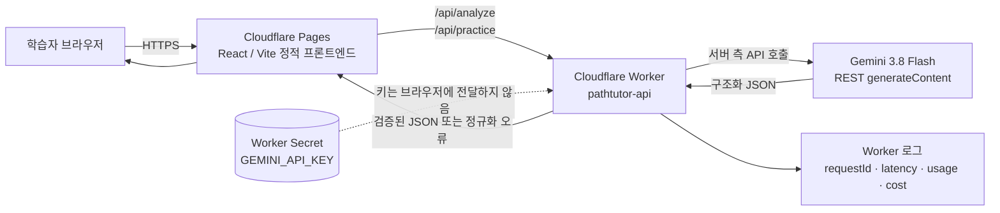
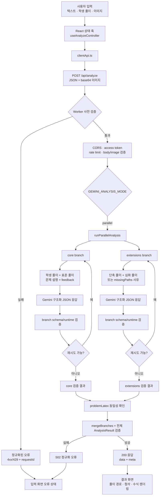
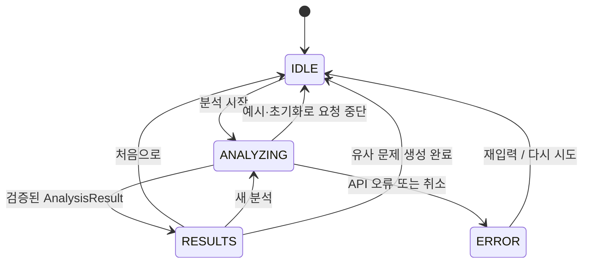
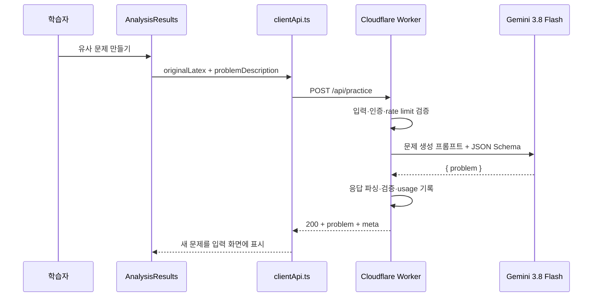
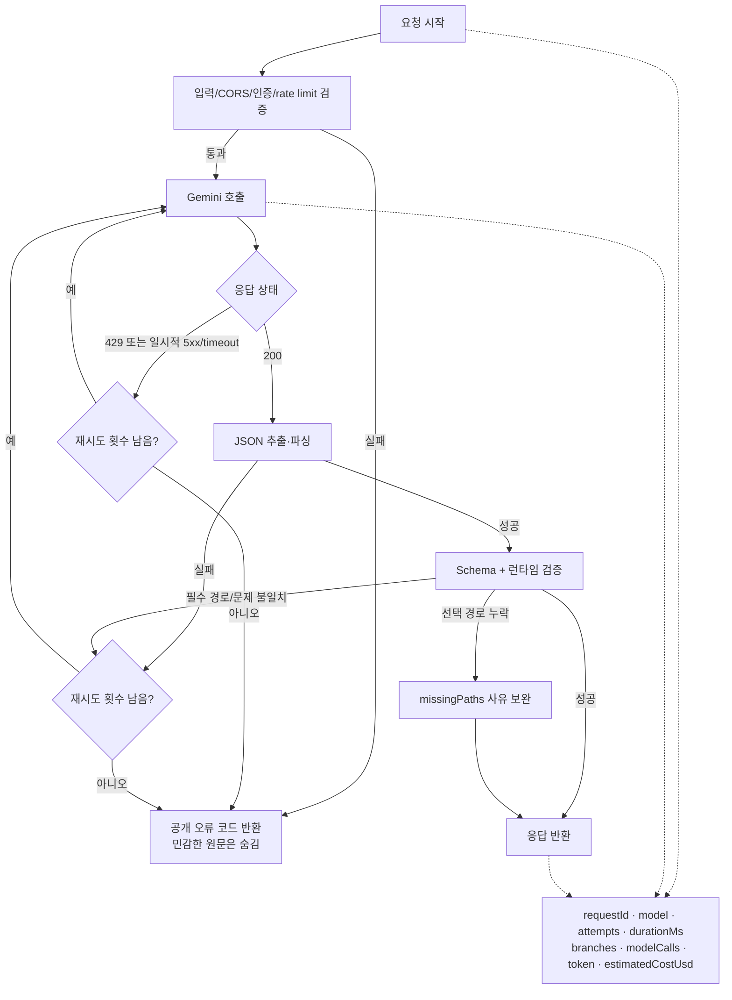
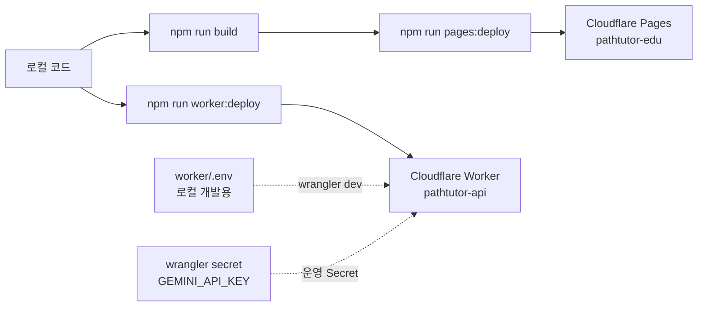

# PathTutor-edu 현재 프로젝트 플로우

> 기준일: 2026-09-12
> 범위: Cloudflare Pages 프론트엔드와 Cloudflare Worker API가 연결된 현재 운영 구조

## 1. 한눈에 보는 배포 구조

현재 접속 주소는 다음과 같습니다.

| 역할 | 주소 | 상태 |
| --- | --- | --- |
| 프론트엔드 기본 주소 | `https://pathtutor-edu.pages.dev` | 배포 완료 |
| 프론트엔드 커스텀 주소 | `https://pathtutor.eunryong.win` | Pages 등록 완료, CNAME 연결 대기 |
| 분석 API | `https://pathtutor-api.pathtutor.workers.dev` | 배포·운영 smoke test 완료 |
| API 상태 확인 | `GET /api/health` | 모델명과 `ok` 반환 |

커스텀 도메인은 Pages에 등록되어 있지만 DNS에 `pathtutor → pathtutor-edu.pages.dev` CNAME이 추가되어야 활성화됩니다. 도메인 연결 전에도 Pages 기본 주소로 동일한 프론트엔드를 확인할 수 있습니다.

## 2. 수학 풀이 분석 흐름

### 분석 요청의 경계

1. `AnalysisInput`은 텍스트, 이미지 base64, MIME 타입을 포함합니다.
2. 브라우저는 이미지 형식과 6MB 제한을 먼저 확인하고 `services/clientApi.ts`에서 Worker로 전송합니다.
3. Worker는 Origin, 선택적 Bearer 토큰, rate limit, JSON body 크기, 이미지 MIME 타입과 파일 시그니처를 확인합니다.
4. `runParallelAnalysis`는 `core`와 `extensions`를 동시에 시작합니다. 두 요청 모두 완료될 때까지 기다리므로 실패한 비동기 작업이 분리되어 남지 않습니다.
5. 각 branch는 Gemini에 프롬프트, 텍스트, 선택적 이미지를 전달하고 `responseMimeType: application/json` 및 branch별 JSON Schema를 사용합니다.
6. 구조화 JSON이 애플리케이션 검증을 통과하지 못하면 제한된 재시도 동안 오류 힌트를 포함해 해당 branch만 다시 요청합니다.
7. `standard`는 필수 경로입니다. `shortcut`과 `genius`를 만들기 어려운 경우에는 `missingPaths`에 수학적 사유를 남기고 결과를 완성합니다.
8. 두 branch의 `problemLatex`가 다르면 서로 다른 문제를 분석한 것으로 보고 병합하지 않습니다.
9. 최종 응답에는 풀이 결과와 함께 `requestId`, 모델, 시도 횟수, branch별 소요 시간, token usage, 추정 비용이 포함될 수 있습니다.

## 3. 프론트엔드 상태 흐름

`useAnalyzeController`가 화면 상태와 `AbortController`를 관리합니다. 분석 취소와 유사 문제 생성 취소는 서로 다른 요청을 중단하며, 예시 노트는 외부 API를 호출하지 않고 로컬 fixture 결과를 사용합니다.

## 4. 유사 문제 생성 흐름

유사 문제 생성은 분석 결과를 다시 분석하는 경로가 아니라 `/api/practice`를 사용하는 별도 요청입니다. 예시 결과에서 같은 버튼을 누르면 비용이 드는 API 호출 대신 준비된 연습 문제를 입력 화면에 넣습니다.

## 5. 오류·재시도·관측 흐름

로그에는 디버깅에 필요한 메타데이터만 남기며, 사용자 원문·손글씨 이미지·API 키는 로그에 저장하지 않습니다. Worker의 `safeUpstreamReason`도 외부 오류를 짧게 정리하고 키 패턴을 마스킹합니다.

## 6. 배포·환경 변수 흐름

- 브라우저 번들에는 `GEMINI_API_KEY`를 넣지 않습니다.
- `worker/.env`와 운영 Secret은 Git에 커밋하지 않습니다.
- 공개 모델 ID, timeout, retry, CORS Origin, 비용 단가는 `worker/wrangler.toml`의 비밀이 아닌 변수로 관리합니다.
- Gemini 요청은 Worker 서버 측에서만 수행합니다.

## 7. 현재 구현 상태와 다음 경계

### 구현된 핵심 경로

- 텍스트 입력과 이미지 OCR 입력을 `/api/analyze`로 통합
- `core`/`extensions` 2회 병렬 Gemini 호출
- JSON Schema와 런타임 검증
- 필수 `standard` 경로 및 선택 경로 누락 사유 처리
- 제한된 재시도와 공개 오류 코드
- `/api/practice` 유사 문제 생성
- Worker placement를 `gcp:asia-northeast3`로 설정
- 운영 Worker의 텍스트·이미지·practice smoke test 3/3 성공

### 아직 운영 연결이 필요한 부분

- `pathtutor.eunryong.win`은 Pages custom domain에 등록되었고 DNS CNAME 연결이 완료되면 활성화됩니다.
- 고정 테스트셋 기반 OCR 품질·누락률·응답 시간·비용 비교는 별도 평가 작업입니다.
- Veo 영상 생성은 핵심 분석 흐름에 포함하지 않고 실험 기능으로 분리합니다.
- 요청량이 늘어 isolate-local rate limit의 한계를 확인하면 분산 rate limit 또는 비동기 job을 검토합니다.

## 8. 관련 문서

- [README](../README.md)
- [운영 가이드](./OPERATIONS.md)
- [리팩토링 플랜](./REFACTORING_PLAN.md)
- [프롬프트 로그](./PROMPT_LOG.md)
- [병렬 분석 설계](./PARALLEL_ANALYSIS.md)
- [UI/UX 구현 기록](./UI_UX_IMPLEMENTATION.md)
- [운영 live test 기록](./LIVE_TEST_2026-09-11.md)
